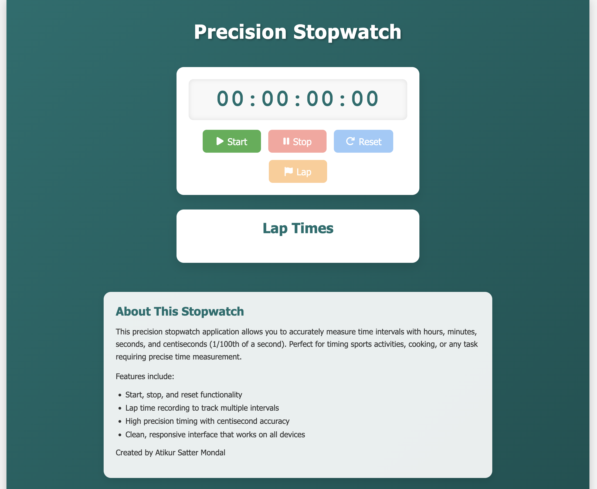

# ⏱️ Precision Stopwatch

A high-precision stopwatch web application with lap timing functionality, built with **HTML**, **CSS**, and **JavaScript**.



## 🚀 Features

- **Precise Timing**: Measures time with centisecond (1/100th second) precision
- **Intuitive Controls**: Simple interface with Start, Stop, Reset, and Lap buttons
- **Lap Recording**: Record and display multiple lap times
- **Responsive Design**: Works seamlessly on desktop and mobile devices
- **Visual Feedback**: Clear display with visual cues for different states

## 🛠️ Technologies Used

- HTML5
- CSS3 (with Flexbox)
- JavaScript (ES6+)
- Font Awesome icons

## 📋 How to Use

1. Click **Start** to begin the stopwatch
2. Click **Stop** to pause the stopwatch
3. Click **Reset** to clear the stopwatch and all recorded laps
4. Click **Lap** while the stopwatch is running to record a lap time

## 💻 Installation

To run this project locally:

```bash
git clone https://github.com/atikur0786/stop-watch.git
cd stop-watch
```

Then open `index.html` in your browser.

## 📁 Code Structure

```bash
stop-watch/
│
├── index.html       # Main HTML structure
├── style.css        # All styling and responsive design
├── script.js        # JavaScript stopwatch logic
└── preview.png      # Screenshot for preview in README
```

## ⚙️ Implementation Details

- Uses `Date.now()` to calculate elapsed time with high precision
- Formats time into hours:minutes:seconds:centiseconds
- Manages running/stopped states to control behavior
- Dynamically enables/disables buttons based on stopwatch state
- Fully responsive layout that adapts across screen sizes

## 🌟 Future Enhancements

- [ ] Add dark/light theme toggle
- [ ] Save lap times using localStorage
- [ ] Add sound effects for button interactions
- [ ] Generate shareable links for lap records

## 🤝 Contributing

Contributions are welcome!

1. Fork the repository
2. Create a new branch: `git checkout -b feature/amazing-feature`
3. Make your changes and commit: `git commit -m 'Add some amazing feature'`
4. Push to your branch: `git push origin feature/amazing-feature`
5. Submit a Pull Request

---

Made with ❤️ using plain HTML, CSS, and JavaScript.
